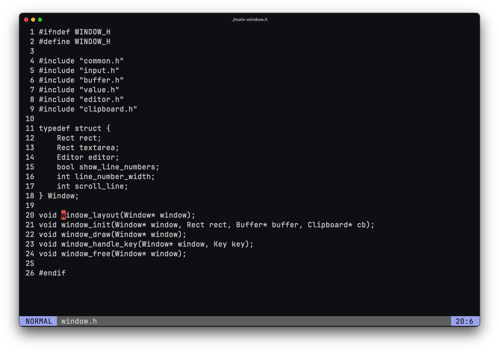

# Simple text editor (C)

A minimal terminal-based text editor written in C using the ncurses library.



## Features
- Modal editing (normal/insert/visual)
- Line numbers and status bar
- Basic vim-style motions (h, j, k, l, o, dd, etc.)
- Visual selection, copy/paste
- Command line (:w, :q, :e)
- File i/o (open/save)

## Highlights
- Custom gap buffer implementation
- Window/layout system

## Build and Run
```bash
gcc -Wall -Wextra -std=c99 main.c memory.c buffer.c app.c window.c editor.c commandline.c clipboard.c color.c -lncurses -o editor
./editor <filename>
```
